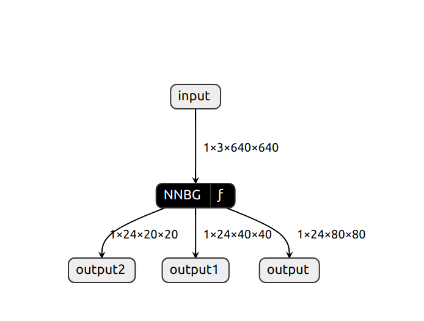

!!!If you have not installed RKNN-toolkit, see instructions in tutorial files.

## 1. Train your custom yolov5 model on your PC follow this tutorial 
[Train Custom Data](!https://docs.ultralytics.com/yolov5/tutorials/train_custom_data/)

## 2. Revise two files in your yolov5 directory
### 2.1 File1:yolov5/models/yolo.py
Change forward function in detect class
```
    def forward(self, x):
        z = []
        for i in range(self.nl):
            z.append(torch.sigmoid(self.m[i](x[i])))
        return z
```

### 2.2 File2: yolov5/export.py
Change variable shape in run function
```
shape = tuple((y[0] if (isinstance(y, tuple) or (isinstance(y, list))) else y).shape)
```

## 3. Export .onnx model
```
python export.py --weights [model-path] --img 640 --batch 1 --include onnx

# e.g. python export.py --weights best.pt --img 640 --batch 1 --include onnx --opset 12
```

## 4. Convert .onnx model into .rknn model
```
python onnx2rknn.py [model-path] [output] [platform]

e.g. python onnx2rknn.py best.onnx bestblimps.rknn rk3588
```

## 5. Check the output of your .rknn model
Use [Netron](!https://netron.app/) to visualize your model input and output. Its input and output should look like this


## 6. Use scp push your .rknn model into RK3588 board
```
scp -r [model] [path]

e.g. scp -r best.rknn opi@opi1:/home/opi/rknn-multi-threaded-3588/rknnModel
```

## 7. Run main.py in your board
!!! To implement model on board, you must install rknn-toolkit2-lite
```
python3 main.py
```
