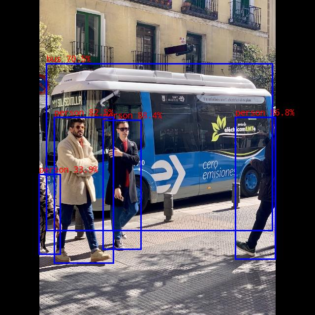

## 1. Download GCC compiler into current folders [link](https://releases.linaro.org/components/toolchain/binaries/6.3-2017.05/aarch64-linux-gnu/gcc-linaro-6.3.1-2017.05-x86_64_aarch64-linux-gnu.tar.xz)

- The file structure is shown as:
  - Projects
    -  rknn-toolkit2
    -  rknn_model_zoo
    -  gcc-linaro-6.3.1-2017.05-x86_64_aarch64-linux-gnu
## 2. Add GCC compiler path to build-linux.sh
```
cd ~/rknn_model_zoo
nano build-linux.sh

# add this command to the header of build-linux.sh
GCC_COMPILER=Projects/gcc-linaro-6.3.1-2017.05-x86_64_aarch64-linux-
gnu/bin/aarch64-linux-gnu
```

## 3. Run build-linux.sh
```
bash ./build-linux.sh -t rk3588 -a aarch64 -d yolov5
# ./build-linux.sh -t <target> -a <arch> -d <build_demo_name> [-b <build_type>] [-m]
```

## 4. Run yolov5 demo
```
cd ~/rknn_model_zoo/install/rk3588_linux_aarch64/rknn_yolov5_demo

# usage: ./rknn_yolov5_demo <model_path> <input_path>
./rknn_yolov5_demo model/yolov5s_relu.rknn model/bus.jpg
```

## 5. Result
